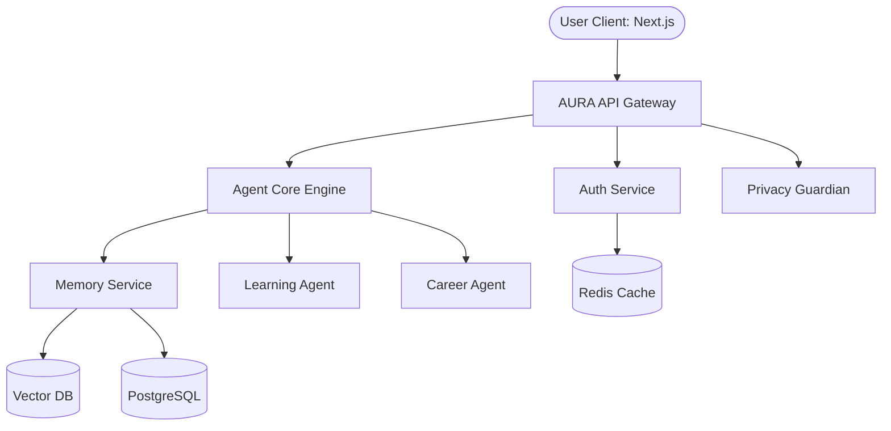

# 🏗️ AURA System Architecture

AURA is built on an enterprise-grade microservices architecture designed for scalability, security, and real-time performance.

## 🧠 Core Architecture

## 🧩 Microservices

1. **aura-api-gateway (8080)**: Central routing, rate limiting, and request validation.
2. **aura-auth-service (8081)**: OAuth 2.0, JWT generation, and session management.
3. **aura-user-service (8082)**: User profile and preferences management.
4. **aura-agent-core (8083)**: The orchestrator. Plans tasks and routes to specific agents.
5. **aura-memory-service (8084)**: Long-term memory storage, RAG embeddings, and context retrieval.
6. **aura-learning-agent (8085)**: Generates and tracks educational roadmaps.
7. **aura-career-agent (8086)**: Resume analysis and interview prep.
8. **aura-privacy-service (8087)**: Manages consent, permissions, and audit trails.
9. **aura-notification-service (8088)**: Real-time WebSocket updates.

## 🔐 Data Flow & Security
- All internal microservice communication is secured.
- The Privacy Service acts as a middleware for all data access to PostgreSQL and VectorDB.
- User requests are never passed to LLMs without scrubbing PII based on active permissions.
